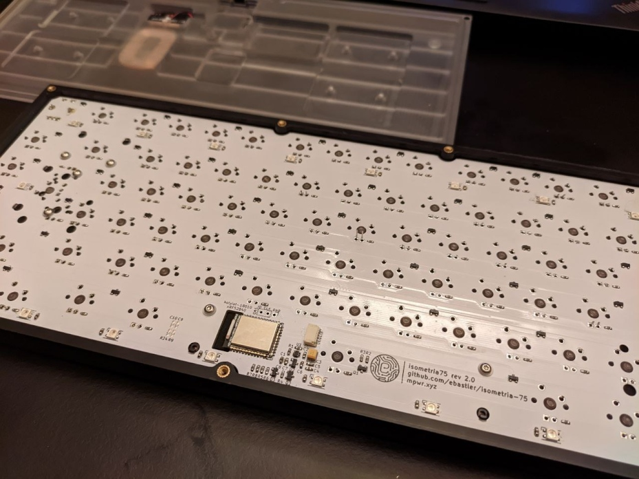
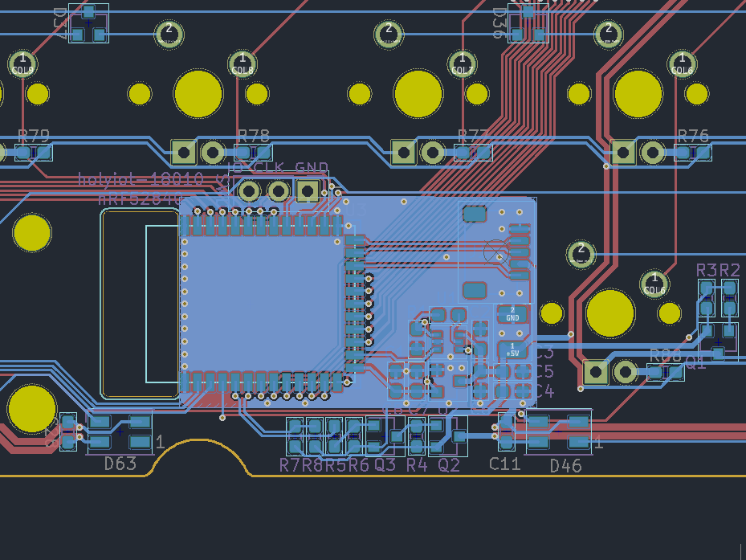
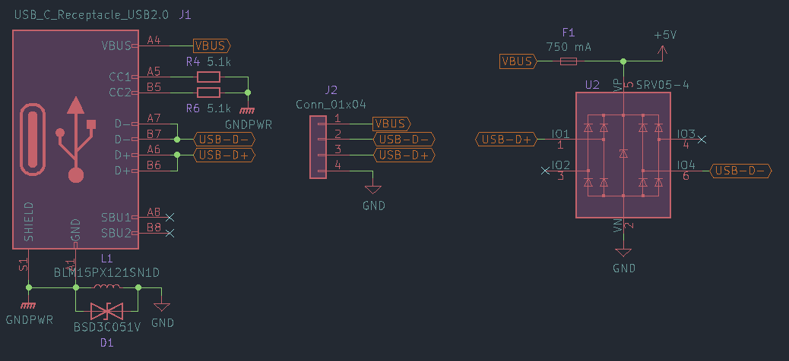
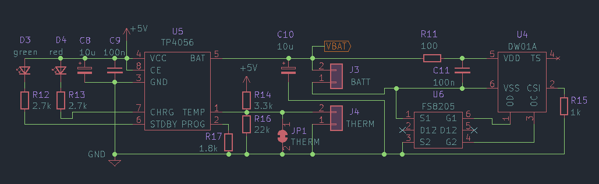
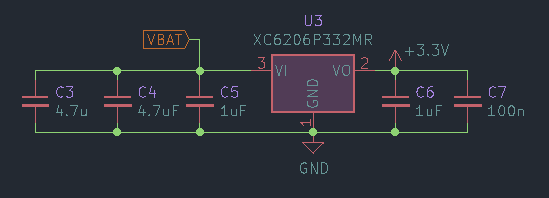
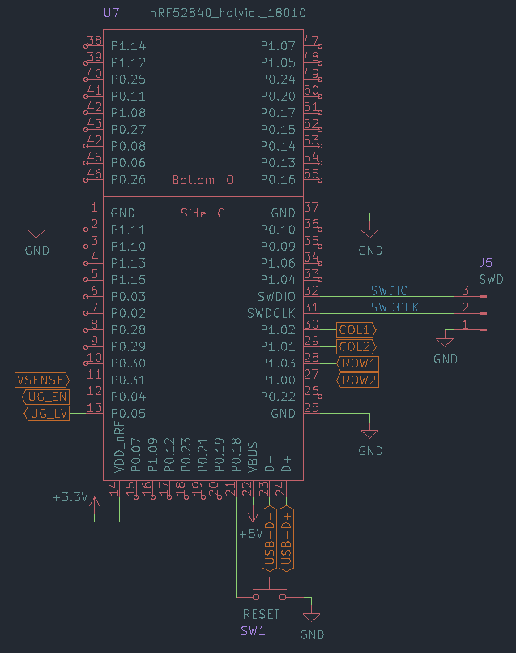
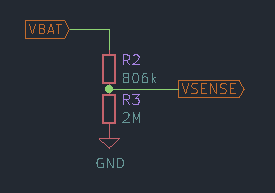
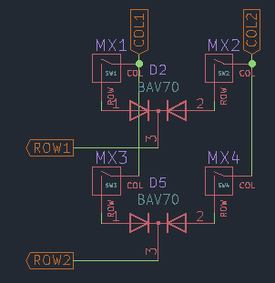
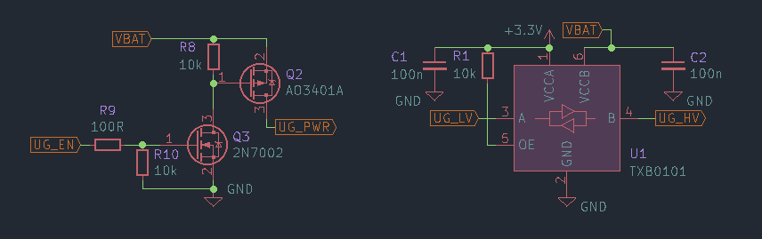
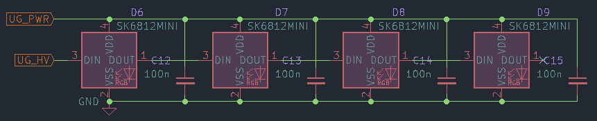

# ZMK Hardware Design Guide

Since [ZMK](https://zmkfirmware.dev/), an open source firmware for (mainly wireless) custom keyboards, is gaining popularity and I have recently designed a board running it ([isometria 75 v2](https://github.com/ebastler/isometria-75/tree/v2)), questions about how to design ZMK compatible hardware have been getting more common. Most keyboard design guides focus heavily on QMK (and QMK compatible MCUs). While ZMK works flawlessly on STM32 (e.G STM32F303) and PCBs for those can be designed the same way as QMK compatible PCBs would be, the main appeal of ZMK is wireless operation, and I will focus on a nRF52840 based design in this guide. Keep in mind, this is no official ZMK team related guide - just a reference implementation from a user, for users. If you notice any errors, please report them either through github, or by contacting me some other way in order for me to fix them.

This is a rather advanced guide that expects some basic electronics knowdledge, as well as design and routing experience. If you do not have those, i would recommend going over the [ai03 PCB design guide](https://wiki.ai03.com/books/pcb-design/page/pcb-guide-part-1---preparations) first. It's a great explanation of most basics needed to design your first keyboard.

Some symboles and footprints I used in this tutorial (most notably, the MCU) are available in my own library, which can be found [on github](https://github.com/ebastler/marbastlib). Since my library has a rather odd way to use switches (stabilized footprints consist of a 1u switch + extra stabilizer footprint, backlight LEDs are separate footprints and not part of the switch footprints either) depending on your preferences and workflow, you may prefer [ai03's switch library](https://github.com/ai03-2725/MX_Alps_Hybrid/) which is proven and probably a bit easier to use.

### **I do not assume any responsibility for broken PCBs or damaged derived from errors in this guide. Use at your own risk, and please open an issue or pull-request if you encounter any errors.**

## TODO
* Update screenshots/explanations to match the slight schematic changes intriduced together with the switch to marbastlib/KiCAD 6
* Add bypass transistor to TP4056 to de-couple the rest of the keyboard from the battery controller during charging - may avoid some possible issues with end-of-charge detection
* Add a more advanced battery controller as a more expensive but better alternative

|isometria 75 pcb| isometria 75 MCU area|
|----------------|----------------------|
|||

## Bluetooth keyboard - what do I need?
This section lists the important parts, as well as some basic considerations. Detailled explanations follow below. There is plenty of compatible parts that work well, some may even work better than the ones I chose. This is, however, focused around parts I am familiar with and have already prototyped to ensure proper operation.

### USB Port and protections
For flashing, possible wired operation and, most importantly, charging, you still need a USB port. I went with a USB-C port. The HRO M12 type connectors are cheap and easy to source, easily hand-solderable and routable and provide great mechanical stability. The protections I chose on this PCB are a good compromise between cost, PCB estate and protections - offering enough protection for a keyboard, while being easy to route. I added a JST 4-pin SH connector as an alternative, which can be used to connect an ai03 unified compatible USB daughterboard.

### Battery management
There's lots of different controllers for this application. I mostly went with the TP4056 + DW01A for a few reasons. They are available at jlcpcb for prototyping, easy to route, and offer programmable charge current - allowing me to set it to the maximum USB 2 allows (600 mA). The DW01A would not be necessary, but offers overcurrent, over-charge and over-discharge protections, which is an important addition with Li batteries.

I chose not to include any power switches, due to ZMKs astonishingly low idle power draw, simplifying the routing. The battery and keyboard are connected in parallel to the charge regulator's output, running the board directly off the battery voltage without any "smart switching" between USB and keyboard. This increases power losses in the charge regulator during wired operation, but simplifies the design without any drawbacks during wireless operation.

### Battery 
Not much to say here. Pick any decent LiIon/LiPo single cell battery that fits your keyboard. More capacity = longer battery life. Try not to poke it with sharp object (switch pins on high-flex plate designs!) or reverse the polarity while connecting it to the PCB if you don't want to burn your house down. Batteries are awful.

### MCU
All is based around a Bluetooth enabled, ZephyrOS capable MCU. In my case, I went with an nRF52840 due to good software support and hardware availability, as well as Bluetooth 5 Low Energy capability. To simplify the design and avoid potential legal issues, I picked a ready-made module. There is plenty of modules out there, but I went with a Holyiot 18010 for multiple reasons:
* Plenty of IO available on castellated side pads, no need for reflow soldering for most boards
* All necessary IO (USB, supply, SWD) available as castellated side pads
* CE FCC RoHS certifications, officially recommended by nordic semiconductors
* Not locked out of the factory - therefore easily flashable with an STlink (OG or clone)
* Ceramic antenna for overkill range

### Optional: Voltage sensing
ZMK supports battery charge reporting over Bluetooth - handy to know how much runtime you have left.

### Optional: Underglow
ZMK supports WS2812/SK6812 adressable LEDs for underglow. Additional power cutting circuits that completely cut the LEDs from the supply voltage while turned off are recommended, because those have rather high idle draw at ~1 mA per LED even when turned completely off and will chew through your battery in no time.

## Schematics and design considerations

### USB connectors and protections

J1 is a basic USB Type C 2.0 connector, as used in most modern custom keyboards. R4 and R6 identify the board as a client for Type C hosts (like smartphones or notebooks connected with a C to C cable). L1, together with the input caps of the board, forms a low-pass filter to eliminate incoming HF noise, induced over badly shielded cables or by GPU/CPU VRMs in the PC. An electrostatic discharge applied to keyboard ground, however, must be able to pass to host GND (and therefore, Earth), but would be blocked by the low-pass as well. For this a suppressor diode is placed in parallel, which allows for high voltage discharges to flow freely.

J2 is a 4pin JST SH connector with the correct pinout to be used with the ai03 unified daughterboard standard. It would for example be compatible with [the various ai03 unified revisions](https://github.com/ai03-2725/Unified-Daughterboard). No ground filtering is present on this connector, since it expected to be done on the DB.

U2 is a cheap and widely used dataline-protector diode + TVS array. It can protect up to 4 data pins (only 2 are used in this case) against voltages higher than VBUS or lower than GND, and the integrated TVS will dissipate any voltage higher than 5 V (or lower than GND) on VBUS. Together with the fuse (F1) this forms an effective protection against over-voltage or reverse-voltage on the supply lines.

### Battery management

I used the wide spread TP4056 battery management IC for this schematic. It offers constant-current charging for 1S Li cells, stopping the charge once the threshold of 4.2 Volts is reached. R17 sets the charging current, in this case it is set to a calculated 650 mA, that turned out to be 550-600 mA on my proto PCBs. This is the maximum USB2 ports allow on most devices. 

D3 and D4 are charge indicators and can be omitted, I would however recommend positioning them in a visible place to see when the board is fully charged.

J4 allows for a temperature sensor to be connected to shut off if the battery should overheat. R14 and R16 were calculated for a wide-spread 10 kOhm thermistor type often used in batteries, but I have since lost my calculations (or the thermistor type) and decrypting chinese datasheets without a translation is a pain so I can't tell the exact type anymore. Most cells you can buy of aliexpress etc. are protected anyway, and this is not needed. If JP1 is left alone, the external thermistor is disabled. R14, R16, JP1 and J4 can be replaced by a simple bridge to GND in that case. If the thermistor is intended to be used, JP1 has to be cut open.

DW01A and FS8205 offer overcurrent, overcharge and over-discharge protection, completely cutting the load (and charging circuit) off the battery if any issues are detected. I used the ref implementation from the datasheet of the DW01A without changes.

### Voltage regulator

The XC6203 is a easily available SOT23-3 LDO with a particularily low dropout voltage. It should be able to reliably supply the nRF down to battery voltages between 3.35 V and 3.4 V - to a point where the battery has little to no remaining capacity, despite most cells allowing discharges down to 2.8 V or 3 V. C5 and C6 are mandatory according to the datasheet, all others were added by me to create a larger buffer. If you plan on adding underglow and/or backlight, you should add additional capacitors to the VBAT side to buffer PWM-fluctuations.

### MCU

The holyiot 18010 module uses the nRFs VDD pin for supply, which can be used up to 3.9 V - hence the voltage regulator. The VBUS pin is used for USB plug detection and should be wired to the USB VBUS (fused), but not be powered while in battery operation. P0.18 / Pin21 is defined as a reset button in the adafruid Bootloader I used and should be connected to ground via a small switch or tweezer-bridgeable pads. SWDIO/SWDCLK must be wired to contact pads, because this is where the STlink/Jlink goes for flashing. 

Vsense must be connected to a pin which offers an analog input, and UG_LV (the actual WS2812 data pin) needs a pin that is not marked as "low frequency I/O". A full list of IOs and their capabilities can be found [in the nordic docs](https://infocenter.nordicsemi.com/index.jsp?topic=%2Fps_nrf52840%2Fpin.html&cp=4_0_0_6_0). Cols and rows can be set freely, however, to minimize power draw, it is recommended to only use either P0.x or P1.x for matrix input pins (with a col2row diode setup, the rows). In our example we only have 4 switches, so routing them all to Port 1 is easy. If you plan on hand soldering, try to avoid the "Bottom IO" labelled IO. You'd need to reflow the module on for those to work.

### Vsense

A voltage divider, used to get the battery voltage down below 3.3 V, allowing the MCU to read the current voltage for battery charge level reporting. These values have been used on the nice!nano before and are somewhat the ZMK default by now.

### Switch matrix

Not much to see here. Just a generic 2x2 switch matrix. I used common cathode SOT-23-3 diodes since I prefer the cleaner look and easier hand solderability of those. Regular 1N4148W or other diodes will work just as well.

### Underglow

This schematic consists of 2 parts. the left allows us to completely cut supply voltage for the underglow when it is disabled (ZMK does this automatically), saving ~1 mA per LED quiescent current - and therefore increasing battery life by multiple orders of magnitude. If the LEDs are turned off, UG_EN is low, therefore the gate of Q3 is low, and the gate of Q2 is high - this leads to no current flowing anywhere in the circuit. Once UG_EN is high, so is the gate of Q3, which in turn pulls the gate of G2 low. In this state, both 10k resistors allow current flowing to GND, but compared to the LED current the current through both resistors is negligibly small.

The right schematic is a levelshifter, intended to translate the 3.3 V signal level from the MCU up to Vbat level output voltages. SK6812MINI need 3.4 V for a logical high, while WS2812 only need 0.7 times Vcc, which would be 2.95V on a full Li battery cell. The levelshifter can be omitted, since both LEDs are proven to work with 3.3 V signal level in most cases - I included it for safety since I did not want to run the SK6812MINI out of specs. In case of doubt, check your desired LED's datasheet. Most need 0.7 times Vcc signal level, which can easily be reached without a levelshifter. And all others (like the SK6812MINI) should work without one too, though out-of-spec.

The LEDs are straightforward - make a chain, connect Vdd to your power source (UG_PWR flag in this case) and the data pin to either UG_HV (if you wanna use the levelshifter) or UG_LV (if you address them directly from the MCU). Don't forget to include the 100 nF cap which most addressable LEDs need and keep it close.