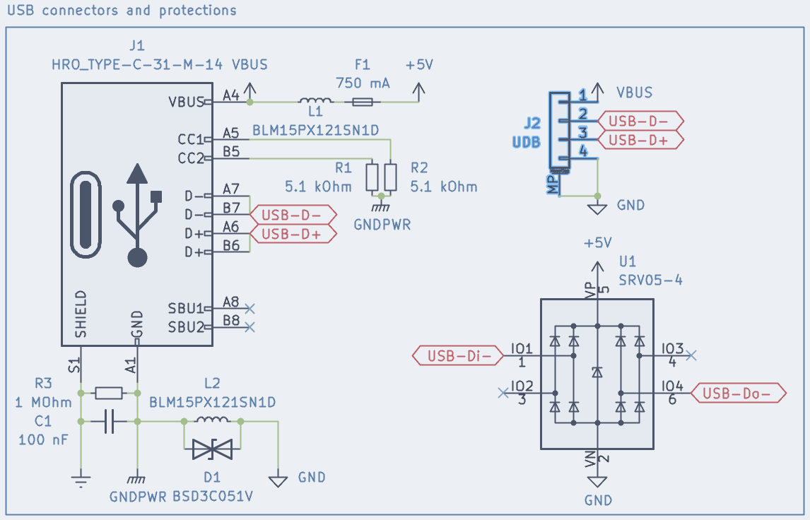
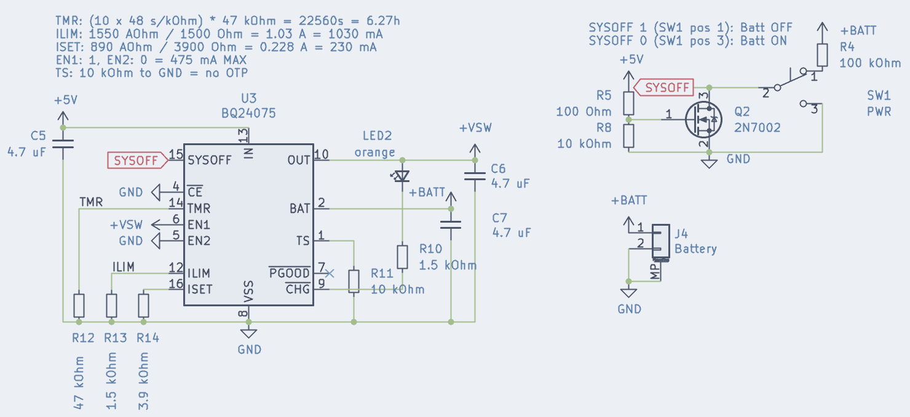
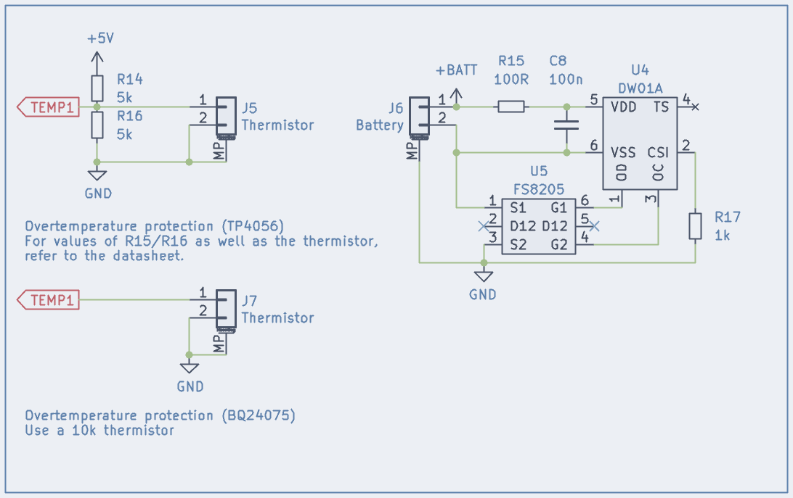

# This guide is still work in progress, and not finished. Please do not use it as a reference just yet. Ping me on discord for possible questions regarding the new implementations that will be explained here once ready.

# ZMK Hardware Design Guide - Revision 3

Since [ZMK](https://zmkfirmware.dev/), an open source firmware for (mainly wireless) custom keyboards, is gaining popularity and I have recently designed a board running it ([isometria 75 v2](https://github.com/ebastler/isometria-75/tree/v2)), questions about how to design ZMK compatible hardware have been getting more common. Most keyboard design guides focus heavily on QMK (and QMK compatible MCUs). While ZMK works flawlessly on STM32 (e.G STM32F303) and PCBs for those can be designed the same way as QMK compatible PCBs would be, the main appeal of ZMK is wireless operation, and I will focus on a nRF52840 based design in this guide. Keep in mind, this is no official ZMK team related guide - just a reference implementation from a user, for users. If you notice any errors, please report them either through github, or by contacting me some other way in order for me to fix them.

This is a rather advanced guide that expects some basic electronics knowdledge, as well as design and routing experience. If you do not have those, i would recommend going over the [ai03 PCB design guide](https://wiki.ai03.com/books/pcb-design/page/pcb-guide-part-1---preparations) first. It's a great explanation of most basics needed to design your first keyboard.

The entire example has been shifted from using various other libraries to entirely relying on kicad default libs as well as [marbastlib](https://github.com/ebastler/marbastlib)

|isometria 75 pcb| isometria 75 MCU area|
|----------------|----------------------|
|||

## Bluetooth keyboard - what do I need?
This section lists the important parts, as well as some basic considerations. Detailed explanations follow below. There is plenty of compatible parts that work well, some may even work better than the ones I chose. This is, however, focused around parts I am familiar with and have already prototyped to ensure proper operation. I will list multiple options, ranging from simpler to more complicated and advanced, usually also more expensive choices. Which is right for you depends on your budget, capabilities and requirements, so I opted for leaving you with multiple choices.

* **USB Port and protections**: For flashing, possible wired operation and, most importantly, charging, you still need a USB port. I went with a USB-C port. The HRO M12 and M14 type connectors are cheap and easy to source, easily hand-solderable and routable and provide great mechanical stability. The protections I chose on this PCB are a good compromise between cost, PCB estate and protections - offering enough protection for a keyboard, while being easy to route. I added a JST 4-pin SH connector as an alternative, which can be used to connect an ai03 unified compatible USB daughterboard.

* **Battery management**: There's lots of different controllers for this application. I will show you two possible choices, a cheaper and a more expensive (but also more feature-rich one). They both are available at jlcpcb for prototyping, easy to route, and offer programmable charge current - allowing to set it to the maximum USB 2.0 allows (600 mA). Power switches are optional, due to ZMKs astonishingly low idle power draw, but examples were included anyway.

* **Battery**: Not much to say here. Pick any decent LiIon/LiPo single cell battery that fits your keyboard. More capacity = longer battery life. Try not to poke it with sharp objects (switch pins on high-flex plate designs! Ideally add a protective FR4 or Alu plate between battery and switch pins) or reverse the polarity while connecting it to the PCB if you don't want to burn your house down. Batteries are awful.

* **MCU**: All is based around a Bluetooth enabled, ZephyrOS capable MCU. In my case, I went with an nRF52840 due to good software support and hardware availability, as well as Bluetooth 5 Low Energy capability. I recommend using a dedicated module instead of the bare chip, due to those offering a wide range of certificates (proving your board won't alert the white vans with the big antennas on the roof), because nRF52840 are rather annoying to route, and it's impossible to reach all pins without 4 layers and microvias, which are serious price-driving options. In this tutorial I will go over two different modules, which each have their pros and cons. There is countless other choices, so I recommend you look for yourself which [of the extensive list](https://www.nordicsemi.com/Nordic-Partners/3rd-party-modules) best fits your needs.

* **Optional: Voltage sensing**: ZMK supports battery charge reporting over Bluetooth - handy to know how much runtime you have left. Depending on the module you use, and the accuracy you want to achieve, multiple options will be discussed.

* **Optional: Underglow**: ZMK supports WS2812/SK6812 adressable LEDs for underglow. An additional power cutting circuit that completely cuts the LEDs from the supply voltage while turned off is recommended, because those have rather high idle draw at ~1 mA per LED even when off and will chew through your battery in no time. Unless your design uses beefy batteries, I would recommend omitting LEDs in general - blinking lights are pretty, but months of battery life are even nicer in my opinion. With a power cutting circuit you give the user the option to choose.

## Schematics and design considerations

### USB connectors and protections
J1 is a basic USB Type C 2.0 connector, as used in most modern custom keyboards. I recommend using either HRO Type-C-31-M-12 (regular top-mount) or HRO Type-C-31-M-14 (mid-mount) as they are proven, reliable and easy to source. 

R1 and R2 identify the board as a client for Type C hosts (like smartphones or notebooks connected with a C to C cable). The ferrite beads L1 and L2, together with the input caps of the board, forms a low-pass filter to eliminate incoming HF noise, induced over badly shielded cables or by GPU/CPU VRMs in the PC. 

An electrostatic discharge applied to keyboard ground, however, must be able to pass to host GND (and therefore, Earth), but would be blocked by the low-pass as well. For this a suppressor diode is placed in parallel, which allows for high voltage discharges to flow freely. 

R1 and C3 terminate Shield to Ground of the USB connector - having a low-impedance connection here would create a large ground loop over the whole cable (since on the host they are connected as well), while the capacitor still allows for RF to be shorted to shield. This is a common way of connecting the USB shield, and to be honest I only copied it from others without too much reasoning. It works. Unless you are ready to enter a rabbit hole, avoid googling how to properly handle USB shield. There seem to be as many opinions as there are electrical engineers on the net.

J2 is a 4pin JST SH connector with the correct pinout to be used with the ai03 unified daughterboard standard. It would for example be compatible with [the various ai03 unified revisions](https://github.com/ai03-2725/Unified-Daughterboard). No ground filtering is present on this connector, since it is expected to be done on the daughterboard.

U2 is a cheap and widely used dataline-protector diode + TVS array. It can protect up to 4 data pins (only 2 are used in this case, you could use the remaining two for CC1/CC2 datalines) against voltages higher than VBUS or lower than GND, and the integrated TVS will dissipate any voltage higher than 5 V (or lower than GND) on VBUS. Together with the fuse (F1) this forms an effective crowbar-like protection circuit against over-voltage or reverse-voltage on the supply lines.

### Battery management
#### Simple implementation
The TP4056 is a very wide-spread chip, available from a variety of brands and easy to implement. It is, however, not suited for powering a circuit while also charging a battery. It measures battery current to determine a fully charged battery, which will lead it to stop charging to avoid damaging the cell. For more information, check out [this blog post](https://www.best-microcontroller-projects.com/tp4056-page2.html). If the keyboard draws additional current, this threshold will be reached later (or not at all), leading to increased battery wear. That's what Q1 is used for - the Shottky diode `D2` will power the MCU directly off 5V USB instead of the battery while plugged in, while during battery powered operation `Q1` serves as an ideal diode (diode without significant forward voltage loss), supplying the MCU off the battery.

The temperature sensor input is disabled in this implementation, since most cells used in keyboards bring their own, built-in temperature protections with them. The value for `R9` (`PROG` input) can be seen in the datasheet for the chip - 5 kOhm results in a charging current of 250 mA. Usually it should be between 0.5C and 1C (for a 500 mAh battery: 250 mA to 500 mA) - refer to your battery datasheet for actual recommended charging currents.

`LED1` serves as an idicator for the current charging state, and will be lit as long as the board is actively charging. The `STDBY` does the opposite, an LED connected to it would be off while charging, and turns on when the charge is complete. Both of these pins, paired with a dual-color-LED could be an interesting choice as well - red while charging, green once full.

`SW2` is a simple power switch to cut the battery from the system - watch oout that the board will also be unable to charge as long as it is flicked off. In addition, the switch has to withstand the entire battery current - finding a suffieciently small footprint switch that can take up to 500 mA (or, in the case of our example, 250 mA) can prove difficult. If you want to imit the power switch, simply connect `+BATT` directly to `J3`.

#### Advanced implementation
The BQ24075 is an advanced "PowerPath" chip from Texas instruments. While the TP4056 is a pure battery charging chip, this one includes a whole lot of features. It will dynamically change the battery charging speed to stay within USB limits, depending on how much the board is drawing, and if a board with many LEDs should end up drawing more than 500 mA, it will even use the battery to temporarily supplement the excess current, in order not to overload the USB port. It also has a very useful "sysoff" feature, that can be used to switch the battery off without the whole battery current passing through the microswitch.

The `EN1` and `EN2` pins decide the maximum allowed input current - depending on the configuration it can be 100 mA, 500 mA or "unlimited", where it can be controlled with an external resistor on the `ILIM` pin. Since keyboards are almost always powered by USB 2.0, I opted for the 500 mA limit. Meanwhile, `ISET` is used to choose the charging current. The formula is `R = 890 AΩ / U`, where `R` is the necessary resistor value, and `U` the charge current in Ampere. In our example we used `U = 250 mA`, hence `R = 890 AΩ / 0.25 A = 3400 Ω`. Since 3400 Ohm is not part of the widely available E12 resistor scale, we opted for `R = 3.9 kΩ`, which would result in a charging current of roughly 230 mA.

The `PGOOD` pin is the "power good" indicator, and shows that the chip is being supplied with stable 5 Volt over USB - this can usually be omitted. `LED2` however indicates that the battery is currently being charged - a very useful information as a user. If you want the power good status indication, add an LED the same way as LED2.

This slightly more complicated schematic makes use of the optional SYSOFF feature. If `SYSOFF` is connected to VBAT, the chip completely cuts the battery from the rest of the schematic. While this can sometimes be desired, it comes with a problem - it would not charge even when plugged in in this mode, which can be very frustrating if you forget about it. That's what Q2 is for. Q2 will pull `SYSOFF` to GND as soon as the board is plugged in for charging, re-enabling the battery as long as it remains connected to a stable USB power supply. Unlike the simple implementation, this switch does not have any significant current flowing through it, and can be chosen a lot smaller.

#### Additional battery management considerations
When using cylindrical batteries like 18650 cells or unprotected pouches, you should add additional protection circuits, since those do not offer any built-in battery protections like most pouch cells do. If you use regular, protected pouch cells as most boards do, you can skip this section.

In this case, adding a temperature sensor would be recommended - with USB 2.0 charging speeds it is basically impossible to overheat a cylindrical cell in common sizes, but additional precautions are always recommended. Sadly this will only work with the TP4056, where you can add 2 resistors and a connector for an external thermistor - for exact values, please consider the datasheet.

An additional important protection is an undervoltage/overvoltage cutoff. For this application, the DW01A is a widespread chip, often used together with the TP4056, but it could be added to a BQ24075 schematic as well. The right schematic in the advanced section shows a possible implementation, which replaces the battery connectors present in the simple or advanced implementation. As you can see, the FS8205 double-MOSFET is connected between the negative battery terminal and circuit ground, allowing the DW01A to cut the battery from the board in any possible failsafe-case. 

If this event is triggered through undervoltage or a short circuit, disconnecting and reconnecting the charger should reset the chip. In the case of overvoltage, you should dispose of the battery, and connect another. 

### MCU - Holyiot 18010
As mentioned earlier, this guide will walk you through the use of two modules, the Holyiot 18010 and the Moko mk08a. The main differences between them lie in power supply and solderability. The holyiot has the big advantage that it can entirely be used with castellated side-facing pads, and hence easily be soldered with a soldering iron. As a disadvantage it has incomplete documentation and no exposed `VDDH` pin that would allow for a high voltage suppyly, so it needs an additional voltage regulator - `U6`.

The holyiot 18010 module uses the nRFs `VDD` pin for supply, which can be used up to 3.9 V. We supply it with an external 3.3V LDO. The `XC6206P330` has exceptionally low quiescent current (power dissipated in the device even without load), is easy to source and has a low dropout voltage (the minimum difference between input and output voltage), making it an ideal choice for this application. 

The `VBUS` pin of the module is used for USB plug detection and should be wired to the fused USB supply voltage (labeled `+5V` in this guide). Both battery schematics will work with this. `P0.18` is defined as a reset button in the adafruid Bootloader I used and should be connected to ground via a small switch or tweezer-bridgeable pads. You will need this to enter the bootloader. `SWDIO`/`SWDCLK` must be wired to contact pads, because this is where the STlink/Jlink/BMP goes for flashing. I usually use a TC2030 connector for this, but unless you want to buy an expensive cable (up to 50 USD), it may be better to use a regular pin header or similar for it.

`VSENSE` must be connected to a pin which offers an analog input.

`UG_LV` (the WS2812 data pin) needs a pin that is not marked as "low frequency I/O". A full list of IOs and their capabilities can be found [in the nordic docs](https://infocenter.nordicsemi.com/index.jsp?topic=%2Fps_nrf52840%2Fpin.html&cp=4_0_0_6_0). Cols and rows can be set freely. If you want to minimize power draw at the cost of slightly more complicated routing, it is recommended to only use either P0.x or P1.x for matrix input pins (with a col2row diode setup, the rows). In our example we only have 4 switches, so routing them all to Port 0 is easy. If you plan on hand soldering, try to avoid the "Bottom IO" labeled IO section. You would need to reflow-solder the module for those to work.

`SCL/SDA` are only needed for a more advanced battery charge sensing, and need pins that are not marked as "low frequency I/O" as well.

### MCU - Moko MK08a
The Moko is a slightly more advanced module, allowing for full HV mode. Quick detour into nRF52840 power management: The Chip operates at two voltage levels - "VDD" is the voltage level of all peripherals - your IO pins will use this voltage, usually 3.3 V. The core operates at an even lower voltage of usually 1.8 V. Additionally it offers a "VDDH" voltage level, which must be higher than VDD, and up to 5.5 V. Now, the nice part - the chip can generate all voltages directly off VDDH itself - either through interal linear voltage regulators, or even using internal DC-DC regulators for even higher efficiency. These need external capacitors and inductors to work though, and not all modules have those components onboard. The Moko does. Therefore you can directly supply it from battery voltage, and you even get higher efficiency (and battery life) than a Holyiot 18010 module could. Big downside of this (and all other modules with this feature) - it has pads at the bottom that are necessary for operation, so it is impossible to hand solder. While this may not be an issue for a larger production run where everything gets reflowed anyway, it is an issue for a small production at jlcpcb, or a hand soldered design.

`VDDH` needs to be connected directly to the output of the battery management schematic, as it is used to power the board. `VDD` serves as an output in this configuration, supplying (very low power) 3.3 V. We will need this to supply the programming port, and if used the levelshifter for the WS2812 signal later on.

A dedicated voltage sensing pin is not needed for this schematic, since the nRF52840 can use `VDDH` for voltage sensing as well, all other pins are handled the same way as on the holyiot.

### Vsense

A voltage divider, used to get the battery voltage down below 3.3 V, allowing the MCU to read the current voltage for battery charge level reporting. These values have been used on the nice!nano before and are somewhat the ZMK default by now.

### Switch matrix

Not much to see here. Just a generic 2x2 switch matrix. I used common cathode SOT-23-3 diodes since I prefer the cleaner look and easier hand solderability of those. Regular 1N4148W or other diodes will work just as well.

### Underglow

This schematic consists of 2 parts. the left allows us to completely cut supply voltage for the underglow when it is disabled (ZMK does this automatically), saving ~1 mA per LED quiescent current - and therefore increasing battery life by multiple orders of magnitude. If the LEDs are turned off, UG_EN is low, therefore the gate of Q3 is low, and the gate of Q2 is high - this leads to no current flowing anywhere in the circuit. Once UG_EN is high, so is the gate of Q3, which in turn pulls the gate of G2 low. In this state, both 10k resistors allow current flowing to GND, but compared to the LED current the current through both resistors is negligibly small.

The right schematic is a levelshifter, intended to translate the 3.3 V signal level from the MCU up to Vbat level output voltages. SK6812MINI need 3.4 V for a logical high, while WS2812 only need 0.7 times Vcc, which would be 2.95V on a full Li battery cell. The levelshifter can be omitted, since both LEDs are proven to work with 3.3 V signal level in most cases - I included it for safety since I did not want to run the SK6812MINI out of specs. In case of doubt, check your desired LED's datasheet. Most need 0.7 times Vcc signal level, which can easily be reached without a levelshifter. And all others (like the SK6812MINI) should work without one too, though out-of-spec.

The LEDs are straightforward - make a chain, connect Vdd to your power source (UG_PWR flag in this case) and the data pin to either UG_HV (if you wanna use the levelshifter) or UG_LV (if you address them directly from the MCU). Don't forget to include the 100 nF cap which most addressable LEDs need and keep it close.